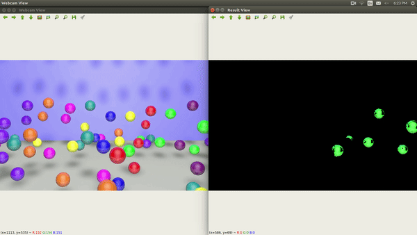

# Demo
A patch of color on the ball is selected to teach which color to detect.
Press "Enter" on webcam view to entering into teach mode.

### [Video Demo](https://www.youtube.com/watch?v=qLh5igTTIkM) from youtube

# How it works?
When a user selects a patch for teaching, the region of interest(ROI) will be converted into HSV color space from RGB color space. On each H, S, and V layer, min and max values are determined. In the result view, any pixel intensity value falls within the min-max range will be shown otherwise it will be hidden per layer.

# Requirements
Python 3.6, Opencv 3.4.7 and other common packages listed in requirements.txt.